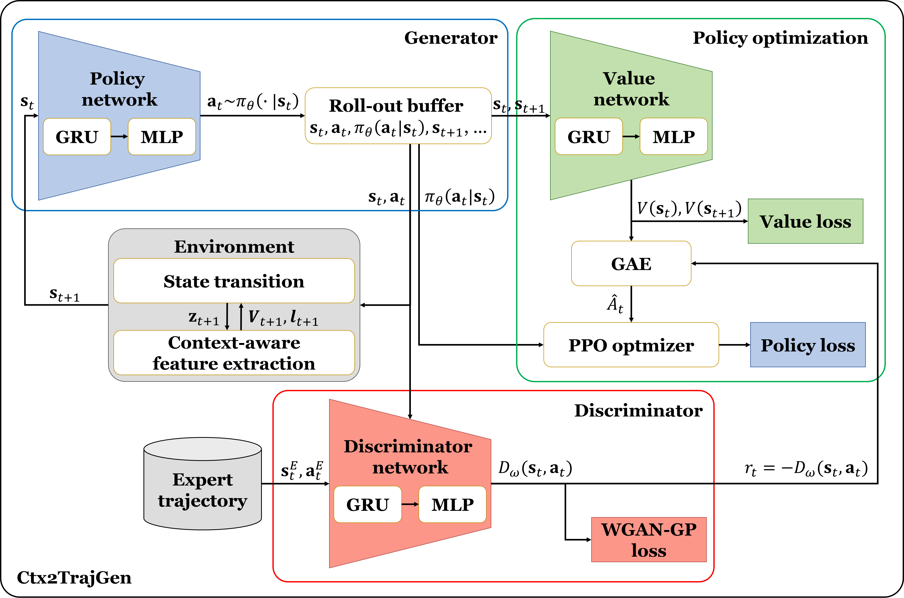

# Ctx2TrajGen: Traffic Context-Aware Microscale Vehicle Trajectories using Generative Adversarial Imitation Learning

[Joobin Jin](https://github.com/joobinJin), [Seokjun Hong](https://github.com/seokjun-h), [Gyeongseon Baek](modifiying), [Yeeun Kim](modifiying), [Byeongjoon Noh](https://scholar.google.com/citations?hl=ko&user=0mPWzzIAAAAJ)

[[`Paper`](https://arxiv.org/abs/2507.17418)] [[`Dataset`](https://huggingface.co/datasets/Hj-Lee/The-DRIFT)] 

## 🚀 Overview



**Ctx2TrajGen**  is a Generative Adversarial Imitation Learning (GAIL) framework for generating microscale vehicle trajectories in real-world traffic scenes. Our model learns realistic vehicle movement patterns by modeling interactions, road structure, and dynamics, without requiring explicit reward design.


## ⚙️ Installation

```bash
# Clone the repository
git clone https://github.com/joobinJin/Ctx2TrajGen.git
cd Ctx2TrajGen
```

```bash
# Create a virtual environment (Python 3.10)
conda create -n Ctx2TrajGen python=3.10
conda activate Ctx2TrajGen
```

```bash
# Install dependencies
pip install -r requirements.txt
```
## 🧪 Running Tests

You can verify each core module (Environment, Discriminator, Policy & Value Network) with the following unit test scripts:

### 1. Environment Test

Runs a simple environment rollout to ensure the `MicroTrajectoryEnv` is properly initialized and functional.

```bash
python test/test_env.py
```

### 2. Discriminator Test

Tests whether the `DiscriminatorRNN` can process sample state-action pairs and output realistic discrimination scores.

```bash
python test/test_discriminator.py
```

### 3. Policy & Value Network Test

Runs inference using `PolicyNetRNN` and `ValueNetRNN` to verify model outputs such as action probabilities and state values for a batch of input trajectories.

```bash
python test/test_policy_net.py
```

## 🏃 Training the Model

To train the full Ctx2TrajGen model using GAIL with PPO and WGAN-GP, simply run:

```bash
python run_gail.py
```

By default, the model uses:
- **PPO** (for stable policy updates)
- **WGAN-GP** (for robust discriminator training)
- Expert demonstrations from `Data/clean_DJI.pkl` with context `Data/C.json`

You can optionally adjust training hyperparameters such as the number of iterations, learning rates, hidden size, etc., using command-line arguments. To see all available options:

```bash
python run_gail.py --help
```

### 🔬 Ablation Study Options

You can toggle PPO and WGAN-GP modules using the following flags:

| Flag | Description |
|------|-------------|
| `--no-ppo` | Disable PPO; use vanilla policy gradient |
| `--no-wgan-gp` | Disable WGAN-GP; use vanilla GAN loss |
| `--vanilla` | Disable both PPO and WGAN-GP (classic GAIL) |

Example commands:

```bash
# Full version (PPO + WGAN-GP)
python run_gail.py

# No PPO (GAIL + WGAN-GP)
python run_gail.py --no-ppo

# No WGAN-GP (GAIL + PPO + Vanilla GAN)
python run_gail.py --no-wgan-gp

# Vanilla GAIL (no PPO, no WGAN-GP)
python run_gail.py --vanilla
```
All experiment logs and models are automatically saved under:

pth/pth_{variant}/


For example:
- Full version → `pth/pth_full/`  
- No PPO → `pth/pth_noPPO/`  
- No WGAN-GP → `pth/pth_noWGAN-GP/`  
- Vanilla → `pth/pth_vanilla/`
